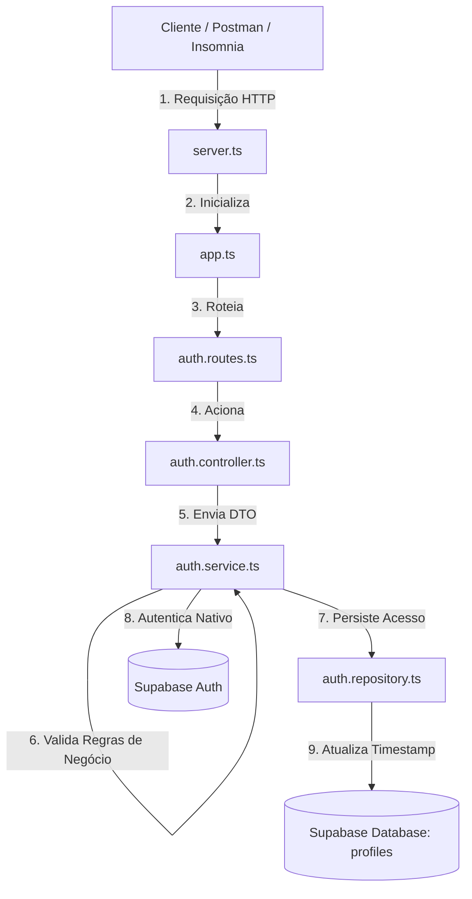

# 🔐 API Autenticação e Controle de Acessos

Esta é uma API RESTful desenvolvida em Node.js com Express e TypeScript para o gerenciamento de autenticação e controle de acesso de usuários. O projeto foi construído seguindo os princípios de **Clean Code** e a arquitetura em camadas (**Controller**, **Service**, **Repository** e **Database**) para assegurar um código desacoplado, altamente testável e de fácil manutenção.

---

## 🏗️ Arquitetura e Fluxo do Projeto

Abaixo está o diagrama que ilustra como uma requisição HTTP navega pelo projeto, passando pelas validações de regras de negócio até persistir os dados nativos de Autenticação e a tabela de perfil no Supabase.



---

## 📂 Estrutura de Arquivos

* **`server.ts`**: Porta de entrada da aplicação. Inicializa o servidor HTTP e escuta na porta definida.
* **`app.ts`**: Configura o Express, injeta os middlewares necessários (como o parser de JSON) e importa as rotas globais.
* **`config/supabase.ts`**: Centraliza a inicialização e configuração do cliente SDK do Supabase.
* **`modules/auth/auth.routes.ts`**: Define os endpoints do módulo de autenticação e injeta as dependências necessárias nas classes.
* **`modules/auth/auth.types.ts`**: Contém as definições de interfaces, tipos e DTOs (Data Transfer Objects) do TypeScript.
* **`modules/auth/auth.controller.ts`**: Responsável por receber as requisições HTTP, validar dados básicos de entrada e enviar as respostas (`res`) ao cliente.
* **`modules/auth/auth.service.ts`**: O coração do Clean Code. Centraliza e orquestra todas as regras de negócio de autenticação (validações, logins e disparos de rotinas).
* **`modules/auth/auth.repository.ts`**: Camada de persistência isolada para o banco de dados. Responsável pelas mutações e consultas na tabela complementar de perfis.

---

## 🛠️ Tecnologias Utilizadas

* **Node.js** (Ambiente de execução)
* **TypeScript** (Tipagem estática e segurança em desenvolvimento)
* **Express** (Framework Web)
* **Supabase** (Backend-as-a-Service: Auth e Banco de Dados PostgreSQL)
* **ts-node-dev** (Ambiente de desenvolvimento com live-reload)

---

## 🚀 Como Configurar e Executar o Projeto

### 1. Configurar o Banco de Dados (Supabase)

No painel do seu projeto Supabase, acesse o **SQL Editor** e execute o script abaixo para criar a tabela complementar de perfis (`profiles`) conectada ao módulo de autenticação nativo:

```sql
-- Criar a tabela complementar de metadados dos usuários
create table public.profiles (
  id uuid references auth.users on delete cascade primary key,
  ultimo_acesso timestamp with time zone default timezone('utc'::text, now()) not null
);

-- Habilitar o Row Level Security para segurança
alter table public.profiles enable row level security;

-- Criar política de segurança permitindo gerenciamento do próprio perfil
create policy "Usuários podem gerenciar o próprio perfil" 
on public.profiles for all 
using (auth.uid() = id);

```

### 2. Criar e Inicializar o Projeto

Caso esteja configurando o projeto do zero no terminal:

```bash
# Inicializar o projeto Node.js
npm init -y

# Criar a estrutura inicial das pastas
mkdir -p src/config src/modules/auth

```

### 3. Instalar as Dependências

```bash
# Instalar dependências de produção
npm install express @supabase/supabase-js dotenv

# Instalar dependências de desenvolvimento
npm install -D typescript@5.4.5 ts-node-dev@2.0.0

# Inicializar o arquivo de configuração do TypeScript
npx tsc --init

```

### 4. Configurar as Variáveis de Ambiente

Crie um arquivo chamado **`.env`** na raiz do projeto e adicione suas credenciais obtidas no painel do Supabase:

```env
PORT=3333
SUPABASE_URL=[https://sua-url-do-supabase.supabase.co](https://sua-url-do-supabase.supabase.co)
SUPABASE_ANON_KEY=seu-token-anon-key-aqui

```

### 5. Executar o Projeto

Certifique-se de que os scripts estão configurados no seu `package.json`:

```json
"scripts": {
  "dev": "ts-node-dev --respawn --transpile-only src/server.ts",
  "clean": "rd /s /q dist",
  "build": "tsc"
}

```

Rode a aplicação em modo de desenvolvimento com o comando:

```bash
npm run dev

```

O servidor iniciará no endereço: `http://localhost:3333`

---

## 🛣️ Endpoints da API

| Método | Endpoint | Descrição | Corpo da Requisição (JSON) |
| --- | --- | --- | --- |
| **POST** | `/auth/registrar` | Cadastra um novo usuário no sistema | `{"email": "user@teste.com", "password": "SenhaForte123!"}` |
| **POST** | `/auth/login` | Autentica o usuário e atualiza o último acesso | `{"email": "user@teste.com", "password": "SenhaForte123!"}` |

---

```

```